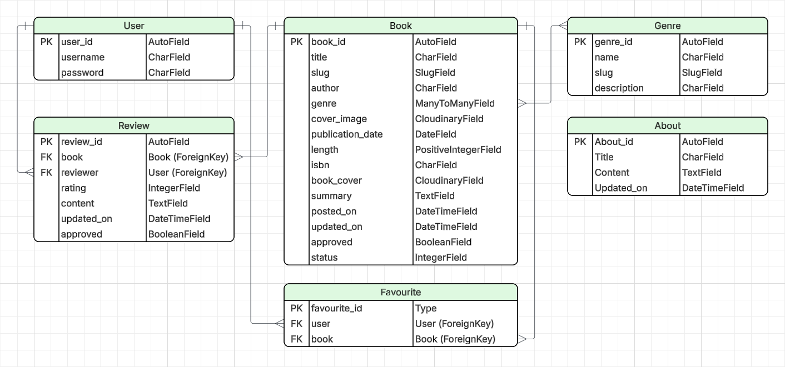

## Table Of Contents:

1. [Design & Planning](#design-&-planning)
   - [User Stories](#user-stories)
   - [Wireframes](#wireframes)
   - [Typography](#typography)
   - [Colour Scheme](#colour-scheme)
   - [Database Diagram](#database-diagram)
   - [Agile Methodology](#agile-methodology)

2. [Features](#features)
   - [Navigation](#Navigation)
   - [Footer](#Footer)
   - [Home page](#Home-page)
   - [Other features](#Other-features)

3. [Technologies Used](#technologies-used)
4. [Testing](#testing)
5. [Bugs](#bugs)
6. [Deployment](#deployment)
7. [Credits](#credits)

## Design & Planning:

### User Stories

**Must Have:**

- As a site user, I can view a paginated list of books on the home page so that I can select which books reviews I want to view.
- As a site user, I can click on a book to see its details so that I can learn more about it.
- As a site user, I can read reviews on an individual book left by other users so that I can judge whether the book interests me.
- As a site user, I can see an option to sign in or register so that I can leave my own reviews.
- As a signed‑in user, I can leave a review on a book’s page so that I can share my opinion with others.
- As a signed‑in user I can edit my own reviews so that I can correct mistakes.
- As a signed‑in user I can delete my own reviews so that remove reviews that no longer reflects my opinion.
- As a signed‑in user, I can see my review appear immediately on the book page so that I know it was submitted successfully.
- As an admin, I can create, read, update and delete books so that I can manage what books are displayed.
- As a site user I can click on the About link so that I can read about the site.
- As an Admin I can approve or disapprove reviews so that I can filter out objectionable reviews.
- As a Site Admin I can create draft book posts so that I can finish writing the content later.

**Should Have:**

- As a visitor I can see a clear visual message when I register an account and when I sign in / out so that I know my action was successful.
- As a signed‑in user I can add a star rating to my review so that I can express my rating of the book to other users.
- As a signed‑in user I can see a clear visual message when I submit or edit a review so that I know it was successfully posted.
- As a signed‑in user I can see a clear visual message when I delete a review so that I know it was removed successfully and no longer appears on the book’s page.
- As a signed‑in user I can request a book to be added to the site so that I can help expand the catalogue when a title I’m interested in isn’t available.
- As a admin I can store book requests in the database so that I can assess if they are suitable for the website and then add them.
- As a site user I can search for books by title or author so that I can quickly find what I’m looking for.
- As a site user I can filter books by genre so that I can discover books that match my interests.

**Could Have:**

- As a signed‑in user I can view all of my reviews on the 'My Reviews' page so that I can easily keep track of the feedback I’ve written across different books.
- As a signed‑in user I can add books to my favourites so that I can easily view them later on my “My Favourites” page

**Won't Have:**

- As a signed‑in user I can like reviews so that I can show which reviews I find helpful and contribute to highlighting the most useful opinions for other readers.
- As a visitor I can see how many likes a review has so that I can quickly judge which reviews other readers found most helpful.
- As a visitor I can sort the list of reviews on a book by most liked to lowest so that I can quickly see which reviews other readers found most helpful.
- As a visitor I can sort the list of books by highest average rating to lowest so that I can quickly find the most well‑reviewed books without having to browse the entire catalogue.

Visit the [ReadView project board](https://github.com/users/hamza-m1/projects/10) to view detailed user stories, including acceptance criteria and tasks.

### Wireframes

To follow best practices, wireframes were developed for mobile, tablet and desktop sizes

Wireframes were created in [Figma](https://www.figma.com/).

#### Mobile Wireframes

Click here to see the Mobile Wireframes

- Home page | Book detail page | Request a book page | About page
  - 
- My favourites page | My reviews page | Sign in page | Sign out page
  - 
- Register an account page | Visitor burger | Signed in burger
  - 

#### Tablet Wireframes

Click here to see the Tablet Wireframes

- Home page | Book detail page | Request a book page
  - 
- About page | My favourites page | My reviews page
  - 
- Sign in page | Sign out page | Register an account
  - 
- page Visitor burger | Signed in burger
  - 

#### Desktop Wireframes

Click here to see the Desktop Wireframes

- Home page | Book detail page
  - 
- Request a book page | About page
  - 
- My favourites page | My reviews page
  - 
- Sign in page | Sign out page
  - 
- Register an account page
  - 

### Typography

The project uses a two-font pairing from [Google Fonts](https://fonts.google.com/):

- **Manrope** (sans-serif) is used as the primary body font for paragraphs, form text, buttons and general UI content.
- **Fraunces** (serif) is used for headings (`h1`–`h6`) and the navbar brand to create a clear visual hierarchy.

This combination was chosen to keep long-form content readable while giving page titles and key labels a distinctive editorial style that fits the book theme of ReadView.

### Colour Scheme

| Colour                      | Value     | Preview                                                   | Usage                                                                                            |
| --------------------------- | --------- | --------------------------------------------------------- | ------------------------------------------------------------------------------------------------ |
| Background                  | `#fefefe` |  | Main page background for a clean, high-readability layout                                        |
| Card Background             | `#ffffff` |  | Used on cards to separate content sections subtly                                                |
| Primary Accent (Light Blue) | `#97bac4` |  | Used for genre badges and highlight elements                                                     |
| Dark Brown                  | `#3c2615` |  | Used for dark sections such as the navbar/footer background                                      |
| Rating Highlight            | `#ffa500` |  | Used for checked star ratings to provide clear visual feedback                                   |
| Faded Text                  | `#b1b1b1` |  | Used for faded text to visually de-emphasise secondary information without reducing readability. |

### Database Diagram

### Agile Methodology

ReadView was developed using an Agile workflow, with work organised and tracked through a GitHub Kanban board.

The Kanban board used the following columns to manage progress:

- **Backlog** – ideas and user stories captured for future refinement.
- **Todo** – prioritised tasks ready to be worked on.
- **In Progress** – items currently being developed.
- **Done** – completed tasks that meet the acceptance criteria.
- **Future Features** – lower-priority enhancements planned for later iterations.

To prioritise features effectively, the project used the **MoSCoW** method:

- **Must Have** – essential functionality required for launch.
- **Should Have** – important improvements that add significant value.
- **Could Have** – nice-to-have features included if time allowed.
- **Won't Have** – features intentionally scoped out for this release.

Each user story on the project board was written with clear **acceptance criteria** and a set of actionable **tasks** to ensure development remained focused, testable, and aligned with project goals.

As progress was made, stories were moved through the board columns. Completed features were documented in **Done**, while potential enhancements were moved to **Future Features** for later iterations.

## Features:

Explain your features on the website,(navigation, pages, links, forms.....)

### Navigation

### Footer

### Other features

## Technologies Used

### Languages

- HTML5
- CSS3
- JavaScript
- Python

### Frameworks & Libraries

- [Django 4.2](https://www.djangoproject.com/) - backend web framework.
- [Bootstrap 5](https://getbootstrap.com/) - responsive layout and UI components.
- [Django Allauth](https://django-allauth.readthedocs.io/) - authentication and account management.
- [Django Crispy Forms](https://django-crispy-forms.readthedocs.io/) with [Crispy Bootstrap 5](https://pypi.org/project/crispy-bootstrap5/) - form rendering and styling.
- [Django Summernote](https://github.com/summernote/django-summernote) - rich-text editing in the admin/content workflow.

### Database & Data Storage

- SQLite - local development database.
- PostgreSQL (via `dj-database-url` and `psycopg2-binary`) - production database configuration.

### Media, Static Files & Deployment

- [Cloudinary](https://cloudinary.com/) and `dj3-cloudinary-storage` - cloud image/media storage.
- [WhiteNoise](https://whitenoise.readthedocs.io/) - serving static files in production.
- [Gunicorn](https://gunicorn.org/) - WSGI application server.
- [Heroku](https://www.heroku.com/) - deployment platform.

### Version Control & Project Management

- Git - version control.
- GitHub - repository hosting and collaboration.
- GitHub Projects (Kanban board) - Agile planning and task tracking.

### Design & Documentation

- [Figma](https://www.figma.com/) - wireframes.

### Testing & Validation Tools

- Chrome DevTools - debugging, responsive testing and performance inspection.
- Lighthouse - accessibility, best-practice and performance auditing.
- [Code Institute Python Linter](https://pep8ci.herokuapp.com/) - Python code validation.
- [JSHint](https://jshint.com/) - JavaScript code validation.
- [W3C CSS Validator](https://jigsaw.w3.org/css-validator/) - CSS code validation.

## Testing

Important part of your README!!!

### Google's Lighthouse Performance

Screenshots of certain pages and scores (mobile and desktop)

### Browser Compatibility

Check compatability with different browsers

### Responsiveness

Screenshots of the responsivness, pick few devices (from 320px top 1200px)

### Code Validation

Validate your code HTML, CSS (all pages/files need to be validated!!!), display screenshots

### Manual Testing user stories or/and features

Test all your user stories, you an create table
User Story | Test | Pass
--- | --- | :---:
paste here you user story | what is visible to the user and what action they should perform | &check;

- and attach screenshot

## Bugs

List of bugs and how did you fix them

## Deployment

The ReadView application was deployed using [Heroku](https://www.heroku.com/) with a PostgreSQL production database and Cloudinary for media file storage.

### Repository Setup

#### Forking the Repository

To create your own copy of this project:

- Navigate to the GitHub repository.
- Click the **Fork** button located in the top-right corner.
- GitHub will create a copy of the repository under your account.

#### Cloning the Repository

To clone the project locally:

- Click the **Code** button on the repository page.
- Copy the HTTPS or SSH URL.
- Open your terminal and run:
  - `git clone <repository-url>`
- Navigate into the project directory:
  - `cd readview`

#### Creating a New GitHub Repository

If starting from scratch:

- Log into your GitHub account.
- Click **New Repository**.
- Enter a repository name (e.g., `readview`).
- Click **Create Repository**.
- Begin development.

### Preparing the Application for Deployment

Before deploying to Heroku, the following production configurations were completed:

- Created an `env.py` file to securely store environment variables.
- Added `env.py` to `.gitignore`.
- Set `DEBUG = False` for production.
- Added the Heroku domain to `ALLOWED_HOSTS`.
- Installed required production packages:
  - `gunicorn`
  - `dj-database-url`
  - `psycopg2-binary`
  - `whitenoise`
- Configured static files using WhiteNoise.
- Configured media file storage using Cloudinary.
- Created a `Procfile` containing:
  - `web: gunicorn readview.wsgi`
- Ran the following command before deployment:
  - `python3 manage.py collectstatic`

### Heroku Deployment

#### Create a Heroku Application

- Log into your Heroku account.
- Click **New** → **Create New App**.
- Enter a unique app name.
- Select your region.
- Click **Create App**.

#### Configure Environment Variables

In the Heroku dashboard:

- Go to **Settings** → **Config Vars**.
- Add the following variables:
  - `SECRET_KEY`
  - `DATABASE_URL`
  - `CLOUDINARY_URL`
  - `DISABLE_COLLECTSTATIC` (if required)
- These values must match those stored locally in `env.py`.

#### Connect Heroku to GitHub

- Navigate to the **Deploy** tab.
- Select **GitHub** as the deployment method.
- Connect your GitHub account.
- Search for your repository.
- Select the `main` branch.
- Enable **Automatic Deploys** or use **Manual Deploy**.

#### Deploy the Application

- Click **Deploy Branch**.
- Wait for the build process to complete.
- Click **View App** once deployment is successful.

### Post-Deployment Checks

After deployment, verify that:

- Static files load correctly.
- Media files upload successfully to Cloudinary.
- PostgreSQL database is connected.
- User authentication and authorization work properly.
- All CRUD functionality operates as expected.

## Credits

List of used resources for your website (text, images, snippets of code, projects....)

- Code & Text Content

- Media

- Acknowledgment
