## Table Of Contents:

1. [Design & Planning](#design-&-planning)
   - [User Stories](#user-stories)
   - [Wireframes](#wireframes)
   - [Typography](#typography)
   - [Colour Scheme](#colour-scheme)
2. [Features](#features)
   - [Navigation](#Navigation)
   - [Footer](#Footer)
   - [Home page](#Home-page)
   - [Other features](#Other-features)

3. [Technologies Used](#technologies-used)
4. [Testing](#testing)
5. [Bugs](#bugs)
6. [Deployment](#deployment)
7. [Credits](#credits)

## Design & Planning:

### User Stories

**Must Have:**

- As a site user, I can view a paginated list of books on the home page so that I can select which books reviews I want to view.
- As a site user, I can click on a book to see its details so that I can learn more about it.
- As a site user, I can read reviews on an individual book left by other users so that I can judge whether the book interests me.
- As a site user, I can see an option to sign in or register so that I can leave my own reviews.
- As a signed‑in user, I can leave a review on a book’s page so that I can share my opinion with others.
- As a signed‑in user I can edit my own reviews so that I can correct mistakes.
- As a signed‑in user I can delete my own reviews so that remove reviews that no longer reflects my opinion.
- As a signed‑in user, I can see my review appear immediately on the book page so that I know it was submitted successfully.
- As an admin, I can create, read, update and delete books so that I can manage what books are displayed.
- As a site user I can click on the About link so that I can read about the site.
- As an Admin I can approve or disapprove reviews so that I can filter out objectionable reviews.
- As a Site Admin I can create draft book posts so that I can finish writing the content later.

**Should Have:**

- As a visitor I can see a clear visual message when I register an account and when I sign in / out so that I know my action was successful.
- As a signed‑in user I can add a star rating to my review so that I can express my rating of the book to other users.
- As a signed‑in user I can see a clear visual message when I submit or edit a review so that I know it was successfully posted.
- As a signed‑in user I can see a clear visual message when I delete a review so that I know it was removed successfully and no longer appears on the book’s page.
- As a signed‑in user I can request a book to be added to the site so that I can help expand the catalogue when a title I’m interested in isn’t available.
- As a admin I can store book requests in the database so that I can assess if they are suitable for the website and then add them.
- As a site user I can search for books by title or author so that I can quickly find what I’m looking for.
- As a site user I can filter books by genre so that I can discover books that match my interests.

**Could Have:**

- As a signed‑in user I can view all of my reviews on the 'My Reviews' page so that I can easily keep track of the feedback I’ve written across different books.
- As a signed‑in user I can add books to my favourites so that I can easily view them later on my “My Favourites” page

**Won't Have:**

- As a signed‑in user I can like reviews so that I can show which reviews I find helpful and contribute to highlighting the most useful opinions for other readers.
- As a visitor I can see how many likes a review has so that I can quickly judge which reviews other readers found most helpful.
- As a visitor I can sort the list of reviews on a book by most liked to lowest so that I can quickly see which reviews other readers found most helpful.
- As a visitor I can sort the list of books by highest average rating to lowest so that I can quickly find the most well‑reviewed books without having to browse the entire catalogue.

Visit the [ReadView project board](https://github.com/users/hamza-m1/projects/10) to view detailed user stories, including acceptance criteria and tasks.

### Wireframes

To follow best practices, wireframes were developed for mobile, tablet and desktop sizes

Wireframes were created in [Figma](https://www.figma.com/).

#### Mobile Wireframes

Click here to see the Mobile Wireframes

- Home page | Book detail page | Request a book page | About page
  - 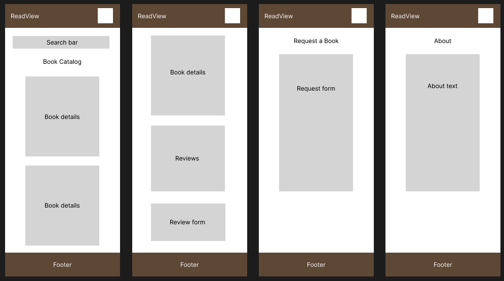
- My favourites page | My reviews page | Sign in page | Sign out page
  - 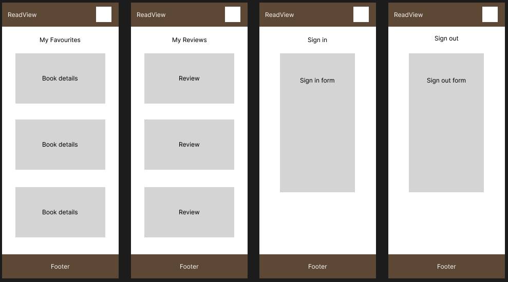
- Register an account page | Visitor burger | Signed in burger
  - 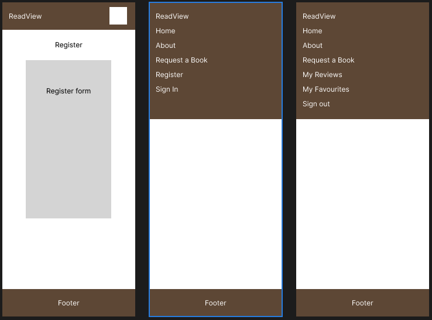

#### Tablet Wireframes

Click here to see the Tablet Wireframes

- Home page | Book detail page | Request a book page
  - 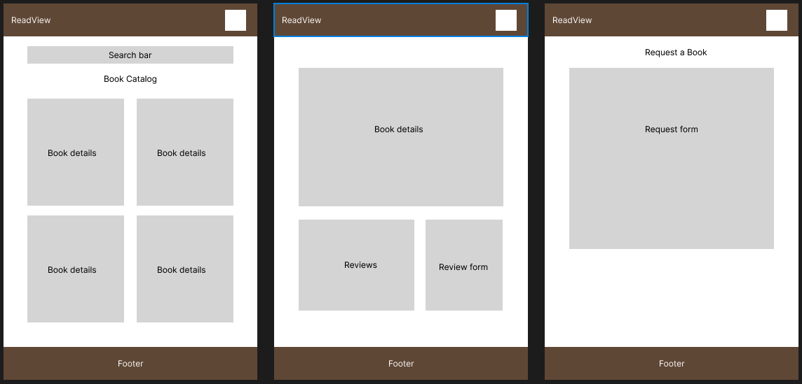
- About page | My favourites page | My reviews page
  - 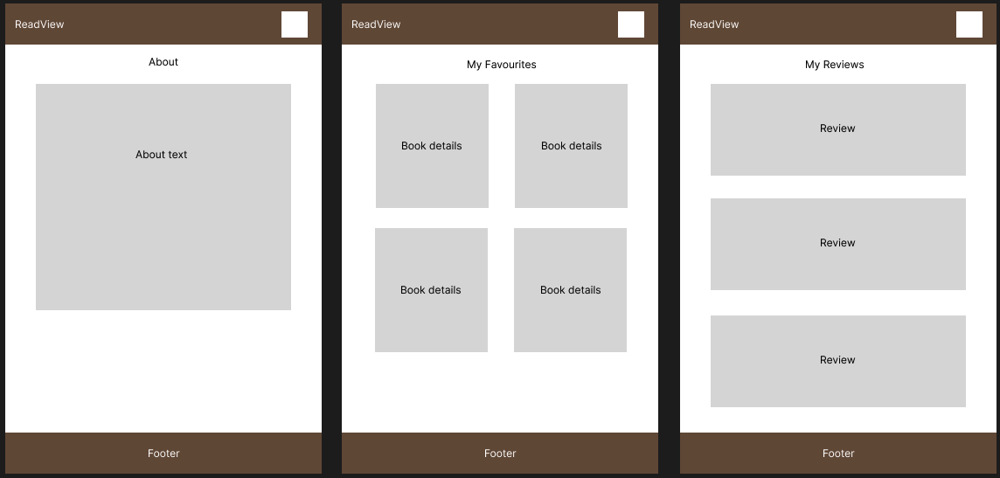
- Sign in page | Sign out page | Register an account
  - 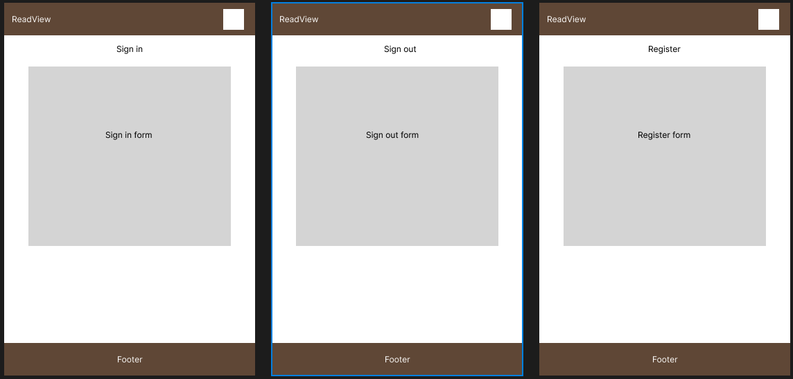
- page Visitor burger | Signed in burger
  - 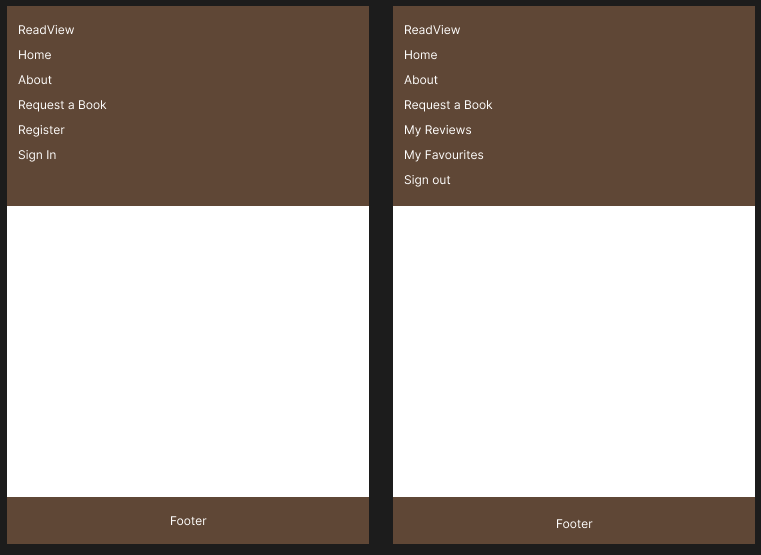

#### Desktop Wireframes

Click here to see the Desktop Wireframes

- Home page | Book detail page
  - 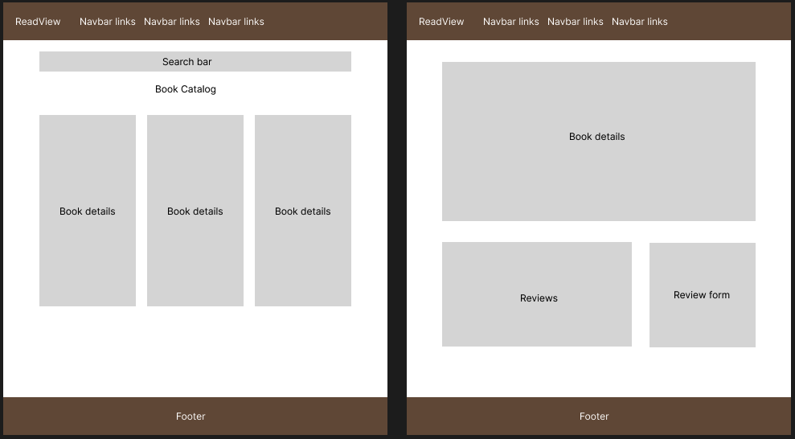
- Request a book page | About page
  - 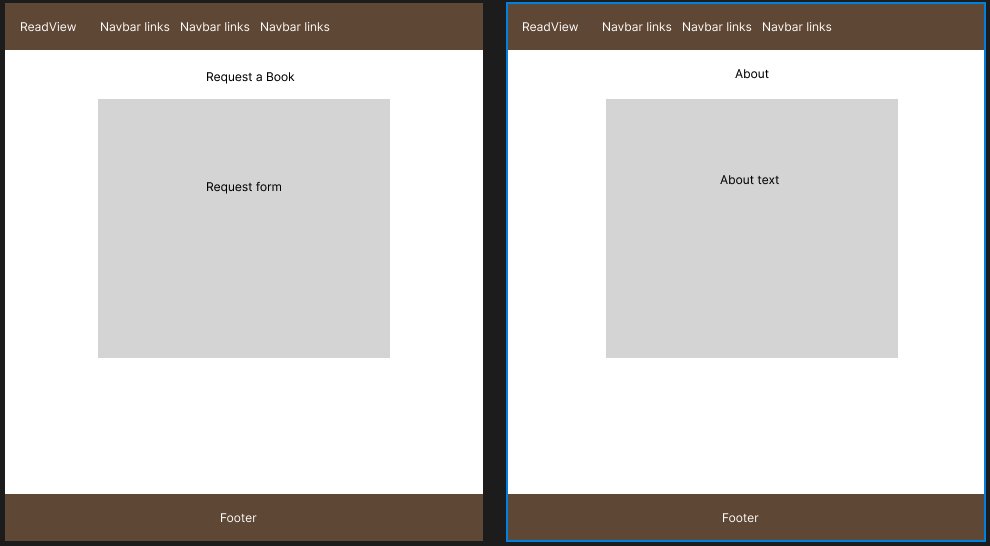
- My favourites page | My reviews page
  - 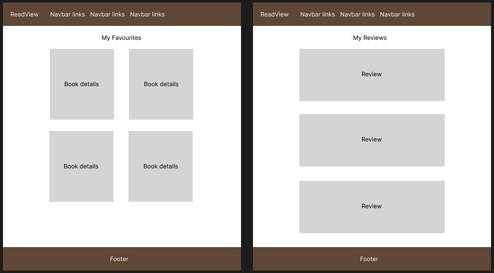
- Sign in page | Sign out page
  - 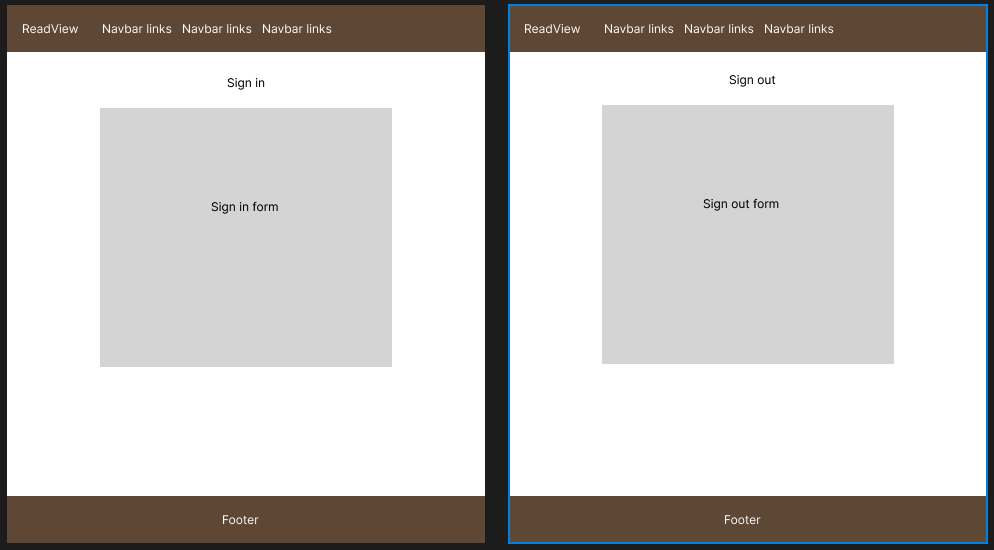
- Register an account page
  - 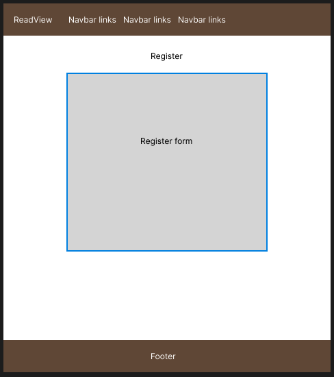

### Typography

The project uses a two-font pairing from [Google Fonts](https://fonts.google.com/):

- **Manrope** (sans-serif) is used as the primary body font for paragraphs, form text, buttons and general UI content.
- **Fraunces** (serif) is used for headings (`h1`–`h6`) and the navbar brand to create a clear visual hierarchy.

This combination was chosen to keep long-form content readable while giving page titles and key labels a distinctive editorial style that fits the book theme of ReadView.

### Colour Scheme

| Colour                      | Value     | Preview                                                                                                                       | Usage                                                                                            |
| --------------------------- | --------- | ----------------------------------------------------------------------------------------------------------------------------- | ------------------------------------------------------------------------------------------------ |
| Background                  | `#fefefe` |  | Main page background for a clean, high-readability layout                                        |
| Card Background             | `#ffffff` |  | Used on cards to separate content sections subtly                                                |
| Primary Accent (Light Blue) | `#97bac4` |  | Used for genre badges and highlight elements                                                     |
| Dark Brown                  | `#3c2615` |  | Used for dark sections such as the navbar/footer background                                      |
| Rating Highlight            | `#ffa500` |  | Used for checked star ratings to provide clear visual feedback                                   |
| Faded Text                  | `#b1b1b1` |  | Used for faded text to visually de-emphasise secondary information without reducing readability. |

## Features:

Explain your features on the website,(navigation, pages, links, forms.....)

### Navigation

### Footer

### Other features

## Technologies Used

List of technologies used for your project...
HTML
CSS
Bootstrap
Github

## Testing

Important part of your README!!!

### Google's Lighthouse Performance

Screenshots of certain pages and scores (mobile and desktop)

### Browser Compatibility

Check compatability with different browsers

### Responsiveness

Screenshots of the responsivness, pick few devices (from 320px top 1200px)

### Code Validation

Validate your code HTML, CSS (all pages/files need to be validated!!!), display screenshots

### Manual Testing user stories or/and features

Test all your user stories, you an create table
User Story | Test | Pass
--- | --- | :---:
paste here you user story | what is visible to the user and what action they should perform | &check;

- and attach screenshot

## Bugs

List of bugs and how did you fix them

## Deployment

#### Creating Repository on GitHub

- First make sure you are signed into [Github](https://github.com/) and go to the code institutes template, which can be found [here](https://github.com/Code-Institute-Org/gitpod-full-template).
- Then click on **use this template** and select **Create a new repository** from the drop-down. Enter the name for the repository and click **Create repository from template**.
- Once the repository was created, I clicked the green **gitpod** button to create a workspace in gitpod so that I could write the code for the site.

#### Deloying on Github

The site was deployed to Github Pages using the following method:

- Go to the Github repository.
- Navigate to the 'settings' tab.
- Using the 'select branch' dropdown menu, choose 'main'.
- Click 'save'.

## Credits

List of used resources for your website (text, images, snippets of code, projects....)

- Code & Text Content

- Media

- Acknowledgment
